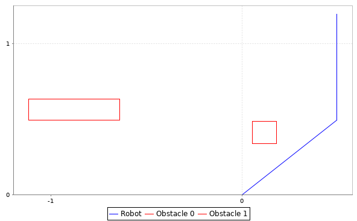
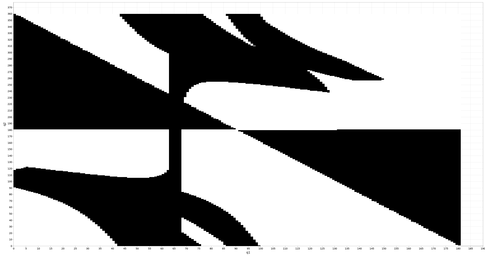
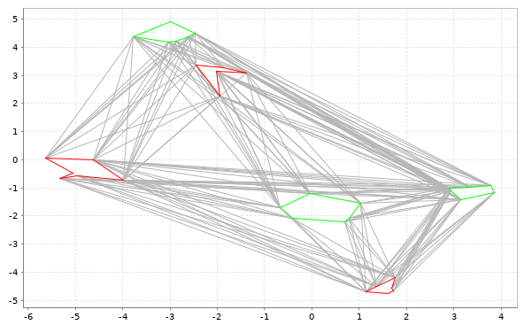
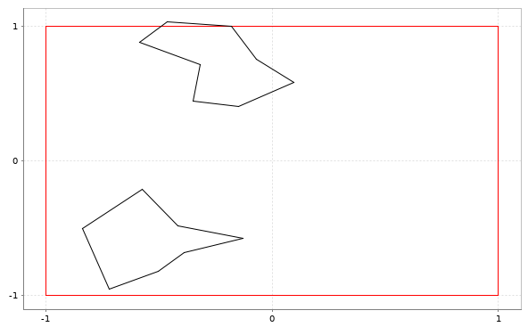
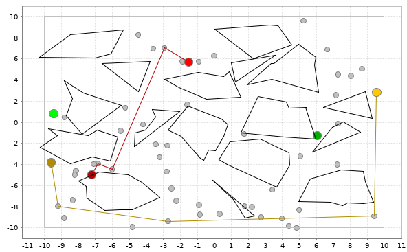
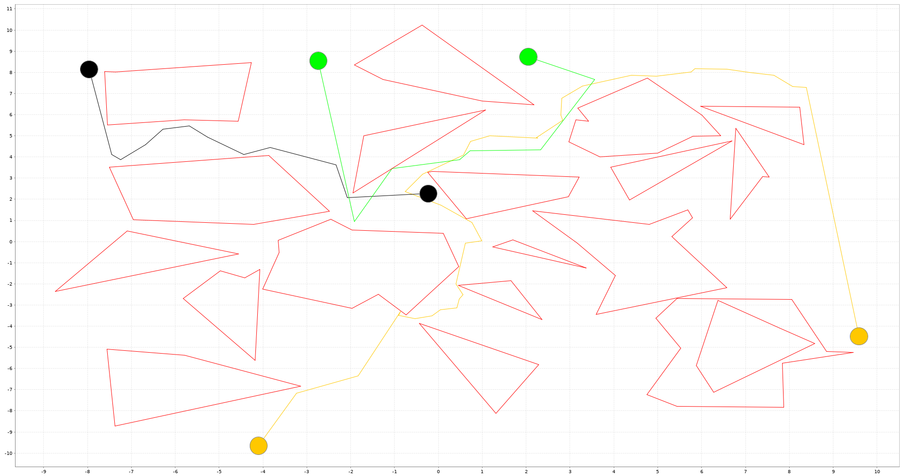

# Robot Motion Planning Exercises
Exercises for the Robot Motion Planning course in summer term 2019 at TUM.
Besides the homework for robot motion planning this project is intended to evaluate the [breeze](https://github.com/scalanlp/breeze) library
for scala. As well as the awesome [scalatest](http://www.scalatest.org/) testing framework.

# How to run
Assuming the scala build tool (sbt) is installed:
```bash
sbt run
```

Or create a distribution using
```
sbt stage
```
and run
```
target/universal/stage/bin/rmp
```

# Example Runs
## 1.1 Configuration Space

- __World:__


- __Configuration Space:__


## 1.2 Visibility Graph


## 1.3 Voronoi Diagram
- __World:__

- __Voronoi Diagram:__


## 2.1 Probabilistic Roadmap (PRM) Pathplanning
The PRM is not connected. No solution found for the black query.


## 2.2 Rapidly-exploring Random Trees (RRT) Pathplanning (single tree mode)

