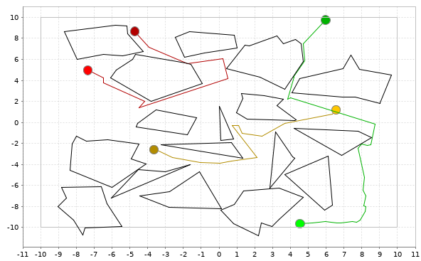

# Robot Motion Planning Exercises
Exercises for the Robot Motion Planning course in summer term 2019 at TUM.
Besides the homework for robot motion planning this project is intended to evaluate the [breeze](https://github.com/scalanlp/breeze) library
for scala. As well as the awesome [scalatest](http://www.scalatest.org/) testing framework.

# How to run
Assuming the scala build tool (sbt) is installed:
```bash
sbt run
```

Or create a distribution using
```
sbt stage
```
and run
```
target/universal/stage/bin/rmp
```

# Example Runs
## 1.1 Configuration Space

- __World:__


- __Configuration Space:__


## 1.2 Visibility Graph


## 1.3 Voronoi Diagram
- __World:__


- __Voronoi Diagram:__


## 2.1 Probabilistic Roadmap (PRM) Pathplanning
The PRM is not connected. No solution found for the green query. 50 samples were used.


## 2.2 Rapidly-exploring Random Trees (RRT) Pathplanning (single tree mode)


## 2.3 Rapidly-exploring Random Trees (RRT) Pathplanning (symmetric bi-tree mode)


# Code Snippets from this Repo
## Single Tree RRT
```scala
trait SimpleRRT extends RandomTreePathPlanner {

  override def plan(start: Point, destination: Point): Option[Path] =
    RRTTreeStream from start take maxTrials find canSeePoint(destination) map computePath(destination)

}
```

## Double Tree RRT
```scala
trait RRT extends RandomTreePathPlanner {

  override def plan(start: Point, destination: Point): Option[Path] = {

    val treeStream = (RRTTreeStream from start) zip (RRTTreeStream from destination)

    treeStream take maxTrials find connectable map computePath
  }
}
```
## Graphs for PRM
```scala
object Graphs {

  /**
    * Perform breadth first search
    *
    * @param g     a graph in map from Vertex to List[Vertex] format
    * @param start start node
    * @param goal  end node
    * @return Shortest path solution if there is one, None otherwise
    */
  def bfs[Vertex](g: Map[Vertex, List[Vertex]], start: Vertex, goal: Vertex): Option[List[Vertex]] = {

    def extractPath(state: Vertex, transitions: Map[Vertex, Vertex]): List[Vertex] = {

      @tailrec def loop(state: Vertex, path: List[Vertex]): List[Vertex] =
        if (state == start) path.reverse :+ goal
        else loop(transitions(state), path :+ transitions(state))

      loop(state, Nil)
    }


    @tailrec def bfsrec(frontier: List[Vertex], explored: List[Vertex], transitions: Map[Vertex, Vertex]): Option[List[Vertex]] =
      frontier match {
        case Nil => None
        case head :: _ if head == goal => Some(extractPath(goal, transitions))
        case node :: tail =>
          val children = g(node) diff (tail ++ explored :+ node)
          bfsrec(tail ++ children, node :: explored, transitions ++ (children map (c => c -> node)))
      }

    bfsrec(start :: Nil, Nil, Map.empty)
  }

  /**
    * Compute number of connected components in the graph
    *
    * @param g the graph in map from Vertex to List[Vertex] format
    * @return Number of connected components 
    */
  def countCommunities(g: Map[_, List[_]]): Int = {
    val n = g.size
    val laplacian: DenseMatrix[Double] = DenseMatrix.zeros(n, n)

    val graphList = g.toList
    val graphKeys = graphList.map(_._1)

    graphList.zipWithIndex foreach {
      case ((_, nbhd), i1) =>
        (0 until n) foreach { i2 =>
          if (nbhd contains graphKeys(i2)) laplacian(i1, i2) = -1.0
        }
        laplacian(i1, i1) = 1.0 * nbhd.size
    }

    eig(laplacian).eigenvalues.valuesIterator.count(p => abs(p) < 1e-6)
  }
}
```

